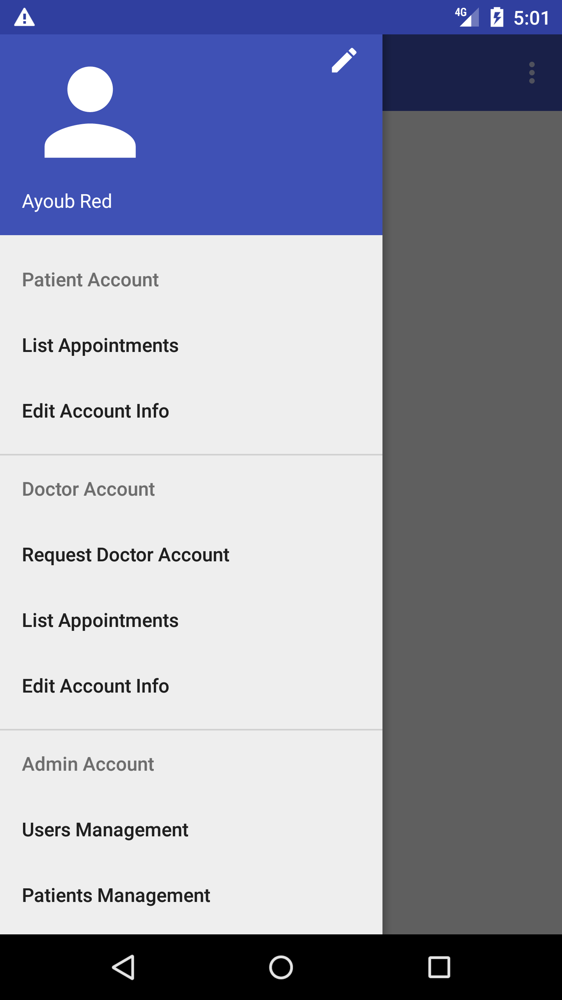
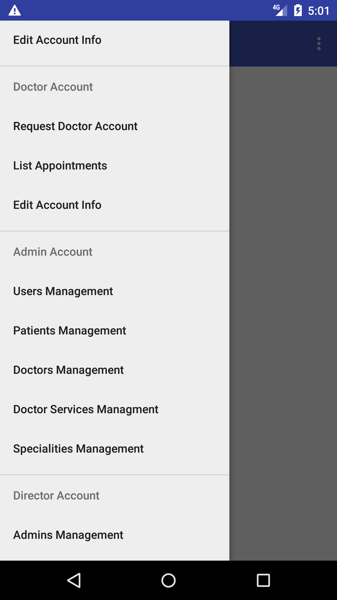

# Doctor Appointmtent App

This is my Bachelor project which I developed an android app that allow patients to book doctors easily here's the report
[Project Report](https://drive.google.com/open?id=1dCmR1o76VYHbCmJAEWJJtvERHBYsSv9R)

## What I Learned
- Use Firebase Auth for authentication
- Apply software engineering techniques
- Creating Secured REST API with role based authentication
- Consuming REST API from android
- Create Appointment System

## Screenshots 

For more screenshots go to [Scrrenshots folder](./Screenshots)

